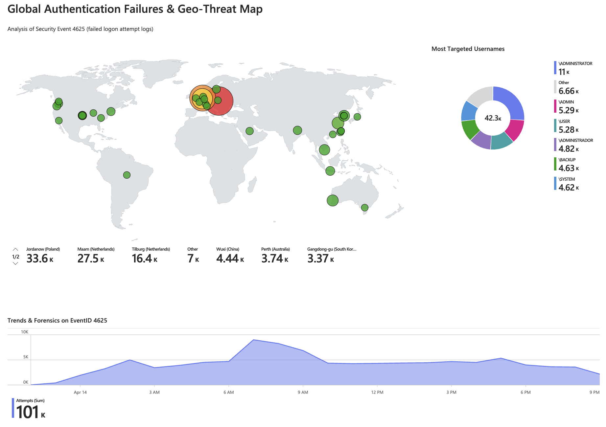

# Azure Sentinel SIEM & Honeypot

Use this guide to build a **cloud-native SIEM lab in Microsoft Sentinel** that captures RDP brute-force activity, enriches failed logon events with geolocation data, and visualizes the results in a workbook dashboard.

## What You Will Build

Set up the lab in this order:

1. Deploy a Windows 10 honeypot VM in Azure.
2. Send Windows Security Events to a Log Analytics Workspace.
3. Enrich failed logons with KQL and a GeoIP watchlist.
4. Build a Sentinel workbook that shows the global attack map, targeted usernames, and attack trends.

## Prerequisites

Before you start, make sure you have:

* An Azure subscription.
* Microsoft Sentinel enabled on a Log Analytics Workspace.
* A Windows VM that you can expose to the internet for the lab.
* Azure Monitor Agent and Data Collection Rules available for log ingestion.
* A GeoIP CSV watchlist for workbook enrichment.

## Build Steps

### 1. Deploy the Honeypot VM
Create a Windows 10 VM in Azure and configure it as a deliberately exposed endpoint. Disable the Network Security Group rules and Windows Firewall controls needed for the lab so the machine can receive public authentication attempts.

### 2. Collect Security Logs
Enable Windows Security Event collection and forward the logs to a Log Analytics Workspace through the Azure Monitor Agent. Confirm that failed logons generate Event ID 4625 entries in the workspace.

### 3. Enrich the Logs with KQL
Upload a GeoIP watchlist such as `geoip-summarized.csv` to Sentinel, then use KQL to join the watchlist with the failed logon events. Map each source IP to latitude, longitude, city, and country so the data can be plotted on a map.

### 4. Build the Workbook Dashboard
Create a Sentinel workbook that turns the enriched data into a visual summary. Use a map for global origins, a donut or pie chart for the most targeted usernames, and a time-series chart for attack volume over time. Arrange the visuals so the dashboard reads clearly as a forensic overview.



## Sample KQL

Use this query as the basis for the geolocation enrichment step:

```kusto
let GeoIPDB_FULL = _GetWatchlist("geoip");
SecurityEvent
| where EventID == 4625
| evaluate ipv4_lookup(GeoIPDB_FULL, IpAddress, network)
| project TimeGenerated, IpAddress, City, Country, Latitude, Longitude
```

## Workbook Reference

Use [workbook.md](workbook.md) for the companion KQL notes that support the dashboard in [references/workbook.png](references/workbook.png).

